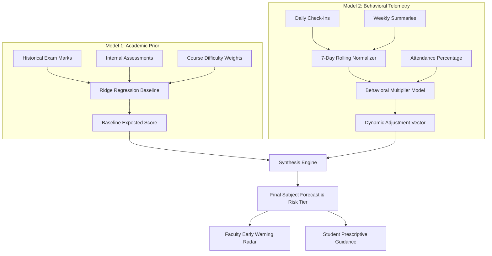

# 🧠 Dual-Model Academic Prediction & Behavioral Telemetry Architecture

> **Specification & Engineering Whitepaper**  
> **Platform**: EduPulse Academic Prediction & Results Engine  
> **Status**: BUILT & ACTIVE  

---

## 1. Executive Summary

Traditional Student Information Systems (SIS) rely strictly on static historical marks recorded at semester end. This leads to **post-mortem analysis**: by the time a student's poor grades appear in the database, the semester is already over and intervention is impossible.

EduPulse introduces a **Dual-Model Inference Architecture**:
1. **Model 1 (Academic Baseline Prior)**: Computes an expected grade trajectory using historical semester exams, internal test performance, and course difficulty weights.
2. **Model 2 (Dynamic Behavioral Multiplier)**: Continuously ingests student habit telemetry (study volume, sleep regularity, motivation index, tutoring) to scale and calibrate the baseline in real time.

To ensure high compliance without user fatigue, students choose their preferred input cadence:
* **Daily Quick-Check (30 sec)**: High-frequency telemetry logged per day.
* **Weekly Summary (2 min)**: Low-frequency aggregated summary logged weekly.

---

## 2. The Dual-Model Architecture

### 2.1 Model 1: Academic Baseline Prior
* **Objective**: Estimate the fundamental academic capability of the student based on past course performance.
* **Feature Vector**:
  * Historical SGPA across prior semesters.
  * Current semester mid-term internal marks ($M_{internal} \in [0, 30]$).
  * Departmental course grading distributions.
* **Characteristics**: Relatively stable, shifts only when official internal tests are graded.

### 2.2 Model 2: Dynamic Behavioral Multiplier
* **Objective**: Measure real-time lifestyle and effort vectors that either amplify or diminish student performance.
* **Feature Vector**:
  * $	ext{Study Hours per Week } (H_{study})$
  * $	ext{Sleep Hours per Night } (H_{sleep})$
  * $	ext{Motivation Level } (M_{lvl} \in \{	ext{Low}, 	ext{Medium}, 	ext{High}\})$
  * $	ext{Tutoring Sessions } (T_{count})$
  * $	ext{Physical Activity Days } (A_{phys})$
  * $	ext{Attendance Percentage } (A_{pct})$
* **Characteristics**: Highly dynamic, recalibrated every time a telemetry entry is recorded.

---

## 3. Habit Data Collection: Daily vs. Weekly Cadence

### 3.1 Design Philosophy
Forcing daily logs on busy college students leads to high abandonment rates after 3–5 days. Offering **cadence flexibility** maintains sustained tracking:

| Mode | Time Required | Description | Ideal For |
| :--- | :--- | :--- | :--- |
| **Daily Quick-Check** | ~30 seconds | Log study hours today, last night's sleep, motivation | Highly disciplined students desiring granular habit streaks |
| **Weekly Summary** | ~2 minutes | Log total weekly study hours, average sleep, reflections | Busy students who prefer reflecting once per weekend |

### 3.2 The Normalization Algorithm (`sync_habits_to_semester_result`)

To feed a uniform feature vector into Model 2, daily and weekly inputs are mathematically normalized into standard weekly metrics:

$$	ext{Hours Studied per Week} = egin{cases} H_{weekly} & 	ext{if mode is WEEKLY} \ \left(rac{1}{N}\sum_{i=1}^N H_{daily, i}
ight) 	imes 7 & 	ext{if mode is DAILY} \end{cases}$$

$$	ext{Sleep Hours per Night} = egin{cases} S_{weekly\_avg} & 	ext{if mode is WEEKLY} \ rac{1}{N}\sum_{i=1}^N S_{daily, i} & 	ext{if mode is DAILY} \end{cases}$$

Where $N$ is the count of daily logs in the rolling 7-day window ($1 \le N \le 7$). If fewer than 7 daily logs exist in the current week, the window expands up to 30 days to prevent volatility.

---

## 4. Database Schema Implementation

### 4.1 `StudentHabitPreference`
Stores the student's chosen cadence and motivational streaks:
* `student`: One-to-one link to `StudentProfile`.
* `frequency`: `DAILY` or `WEEKLY`.
* `streak_count`: Number of consecutive days/weeks logged.
* `last_checkin_date`: Date of the most recent log.

### 4.2 `HabitCheckInLog`
Permanent ledger of every individual submission:
* `student`: Foreign key to `StudentProfile`.
* `log_type`: `DAILY` or `WEEKLY`.
* `log_date`: Date of entry.
* `hours_studied`: Raw hours recorded.
* `sleep_hours`: Sleep duration recorded.
* `motivation_level`: `Low`, `Medium`, or `High`.
* `tutoring_sessions`: Count of tutoring sessions.
* `physical_activity`: Days/hours of physical exercise.
* `notes`: Qualitative student reflections.

### 4.3 `SemesterResult` (Behavioral Fields)
Dynamic snapshot feeding the ML model:
* `hours_studied_per_week` ($0 - 60$)
* `sleep_hours_per_night` ($3 - 12$)
* `attendance_percentage` ($0 - 100$)
* `motivation_level` (Categorical)
* `tutoring_sessions` (Integer)
* `physical_activity` (Integer)

---

## 5. Early Warning Risk Radar & Interventions

Students with a forecasted subject mark below $40\%$ are automatically classified as **At-Risk**.

### Faculty Workflow:
1. **Radar View** (`/at-risk/`): Highlights all students with failing subject trajectories.
2. **Deficit Diagnostics**: Displays whether the root cause is academic (low internal test scores) or behavioral (e.g. study volume $< 8$ hrs/week or attendance $< 75\%$).
3. **Intervention Logging**: Faculty can trigger advising sessions or revision assignments directly from the console.
